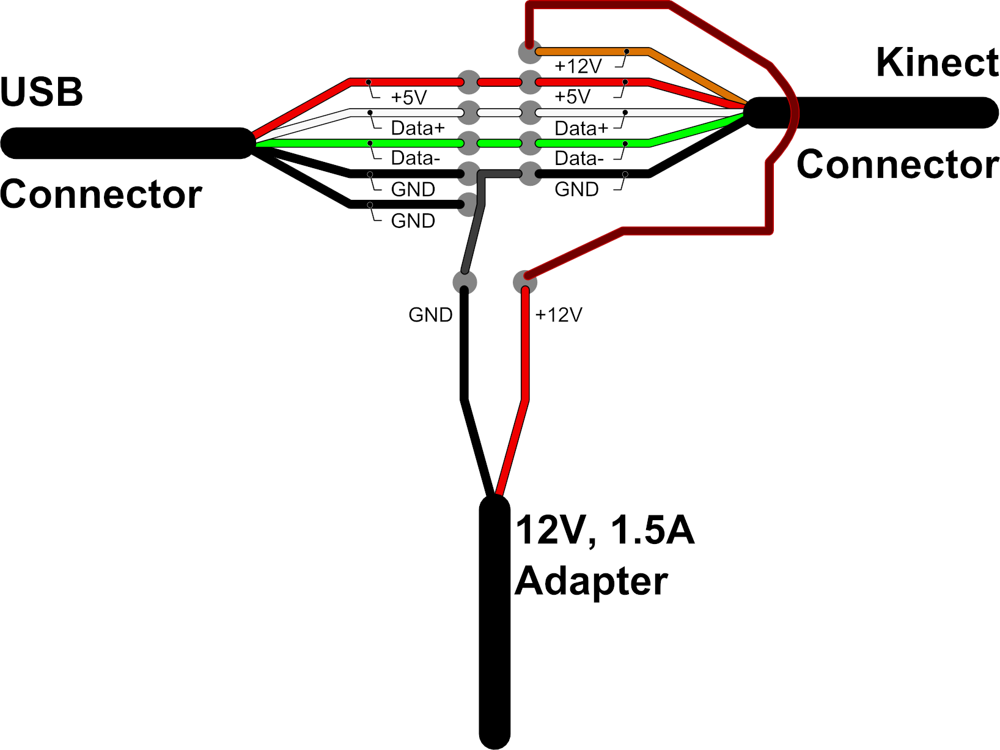

# Xbox 360 Kinect Skeleton Tracking on Modern Linux

### Intro

I wanted to get skeleton tracking working with the Xbox 360 Kinect on Linux, so that I could send joint tracking data to Pure Data in the form of OSC.

I came across this [repository](https://github.com/planktosaur/KinectSkeletontTracking_18.04) which helped me a lot, but I still had to solve a number of problems to get it working. So this repository's README is an attempt to better document how to make this old hardware and software work on modern Linux.

I'm using Arch Linux, but you should be able to follow the process regardless of the distribution you have installed. Be aware, however, that some packages won't have exactly the same name and that the directories for some libraries may be different.

### Adapting the proprietary Kinect plug

You'll have to make your own cable or buy an adapter to connect the Xbox 360 Kinect to your computer.

Source: [user DriverMSG on elektroda.com forums](https://www.elektroda.com/rtvforum/topic3415887.html).

### Dependencies

There are many packages that you may want to check you have installed before starting this process.

- `git`
- `python2` - from [the AUR](https://aur.archlinux.org/packages/python2)
- `libusb`
- `freeglut`
- `jdk17-openjdk` - other distributions and/or versions of the Java JDK should work in a similar way, although I haven't tested them
- `gcc-5` - from [archive.org](https://archive.org/details/archlinux_pkg_gcc5) or [the AUR](https://aur.archlinux.org/packages/gcc5), I'll explain why such an old version later
- `doxygen`
- `graphviz`
- `mono`

These last three are optional and compilation without them should be possible.

### Guide

Create a folder to store all the resources you'll need and then clone the OpenNI repository.

    mkdir kinect
    cd kinect
    git clone https://github.com/OpenNI/OpenNI.git

Now you're supposed to run the `RedistMaker` script, but I couldn't get it to work without some workarounds. Firstly, the script will not run with python 3, so I installed python 2 from the AUR and then called the `Redist_OpenNi.py` script directly.

    yay python2
    python2 Redist_OpenNi.py

Even so, I couldn't get the binaries to compile with a modern version of `gcc`, so I installed an old Arch Linux `gcc-5` package that I found on [archive.org](https://archive.org/details/archlinux_pkg_gcc5), which is also available on the [AUR](https://aur.archlinux.org/packages/gcc5). To use this old version of `gcc`, I followed the instructions [on this page](https://unix.stackexchange.com/a/486059) to simply create a symlink from its binaries to `/usr/local/bin/gcc` and `/usr/local/bin/g++`.

    ln -s $(which gcc-5) /usr/local/bin/gcc
    ln -s $(which g++-5) /usr/local/bin/g++
    hash -r

One more symbolic link was needed for the compiler to work: from `/usr/lib/libmpfr.so.6` to `/usr/lib/libmpfr.so.4`. Apparently, this has to do with [the fact that `libmpfr.so.4` is no longer supplied with the x86_64 version of `gcc`](https://stackoverflow.com/a/51307924) (from what I could gather, but don't quote me on that).

    ln -s /usr/lib/libmpfr.so.6 /usr/lib/libmpfr.so.4

You should now finally be able to run the script. Setting up this old version of the compiler will also be useful for building the next necessary components.

    python2 Redist_OpenNi.py

After that, run the `install.sh` script that was placed in the newly created `Redist` directory.

    cd ../Redist/OpenNI-Bin-Dev-Linux-x64-v1.5.7.10
    ./install.sh

Now you'll need a patched version of the "PrimeSense Sensor Module for OpenNI" drivers. The [original guide](https://github.com/planktosaur/KinectSkeletontTracking_18.04#step-3-clone-drivers) suggests cloning [avin2's repository](https://github.com/avin2/SensorKinect), but I got it to work with [avilleret's fork](https://github.com/avilleret/SensorKinect), which added a missing definition. Note that I wanted to build the drivers myself, but you should be able to use the tarballs that are included in the `Bin` folder.

    cd ../../../../../ # back to the main folder
    git clone https://github.com/avilleret/SensorKinect.git
    cd SensorKinect/Platform/Linux/CreateRedist
    ./RedistMaker

Now I've came across yet another error: apparently the `libXnDDK.so` library was missing. The only way I could get the drivers to compile was to manually copy this file from the pre-compiled tarball to `/usr/lib`.

    cd ../../../Bin
    tar -xf SensorKinect093-Bin-Linux-x64-v5.1.2.1.tar.bz2 -C . --strip-components=2 Sensor-Bin-Linux-x64-v5.1.2.1/Lib/libXnDDK.so # extract only libXnDDK.so to the current directory
    cp libXnDDK.so /usr/lib/
    cd ../Platform/Linux/CreateRedist
    ./RedistMaker

Now install the drivers using the `install.sh` script.

    cd ../Redist/Sensor-Bin-Linux-x64-v5.1.2.1
    ./install.sh

Next, you will need NiTE, "an SDK for joint tracking with the Microsoft Kinect". With NiTE, it should be as simple as cloning [the github repository of a cached version of the software](https://github.com/arnaud-ramey/NITE-Bin-Dev-Linux-v1.5.2.23) - since PrimeSense was bought by Apple in 2013 - and using the `install.sh` script.

    cd ../../../../../ # back to the main folder
    git clone https://github.com/arnaud-ramey/NITE-Bin-Dev-Linux-v1.5.2.23.git
    cd NITE-Bin-Dev-Linux-v1.5.2.23/x64
    ./install.sh

That said, if you've got this far without any of the scripts and compilers returning errors, you should have a working skeleton tracker with the Xbox 360 Kinect on Linux. I suggest you try it with the `Sample-Players` example application supplied with NiTE. If you have encountered problems, please refer to the [troubleshooting](#troubleshooting) section.

    cd Samples/Bin/x64-Release
    ./Sample-Players

### Cleaning up

You may want to erase the `gcc`, `g++` and `libmpfr.so.4` symbolic links.

    rm /usr/local/bin/gcc /usr/local/bin/g++ /usr/lib/libmpfr.so.4
    hash -r

### OSCeleton

If you're interested in easily obtaining skeleton tracking data via OSC, I suggest you try [OSCeleton](https://github.com/Sensebloom/OSCeleton). The developer hasn't provided binaries for this one, so you'll have to compile it yourself, which will probably involve uncommenting the `#include <unistd.h>` line in the `liblo-0.26-modified/examples/example_server.c` file. I couldn't compile it without this small adjustment. Note that here I was already using a modern version of `gcc`.

    cd ../../../../../ # back to the main folder
    git clone https://github.com/Sensebloom/OSCeleton.git
    cd OSCeleton
    sed -i 's|//||g' liblo-0.26-modified/examples/example_server.c # delete all occurrences of the pattern "//" in that file
    make
    ./osceleton

Refer to the [OSCeleton repository](https://github.com/Sensebloom/OSCeleton) for more information.

### Troubleshooting

#### Auto-suspend

If the OpenNI or NiTE sample applications are reporting that the Kinect is not connected, power management software such as `tlp` may be automatically suspending the device. `lsusb` is supposed to report three different Kinect-related devices: audio, motor and camera. If you're only seeing one of these listed consistently, you want to create a file like `/etc/tlp.d/01-kinect.conf` and add the three device IDs to a `USB_DENYLIST` rule, like this:

    USB_DENYLIST="045e:02c2 045e:02ad 045e:02ae"

Keep in mind that these IDs may be different for your specific model. I found mine by running `lsusb` until all three appeared. You can then run the following command to reload tlp's USB auto-suspension settings:

    tlp usb

#### Failed to set USB interface

If the OpenNI or NiTE sample apps are returning an `InitFromXml failed: Failed to set USB interface!` error, try removing the `gspca_kinect` kernel module.

    modprobe -r gspca_kinect

### References

- [KinectSkeletontTracking_18.04](https://github.com/planktosaur/KinectSkeletontTracking_18.04)
- [Ubuntu + Kinect + OpenNI + PrimeSense](https://mitchtech.net/ubuntu-kinect-openni-primesense/)
- [FAQ - OpenKinect](https://openkinect.org/wiki/FAQ#Under_Linux,_my_kinect_is_not_found)
